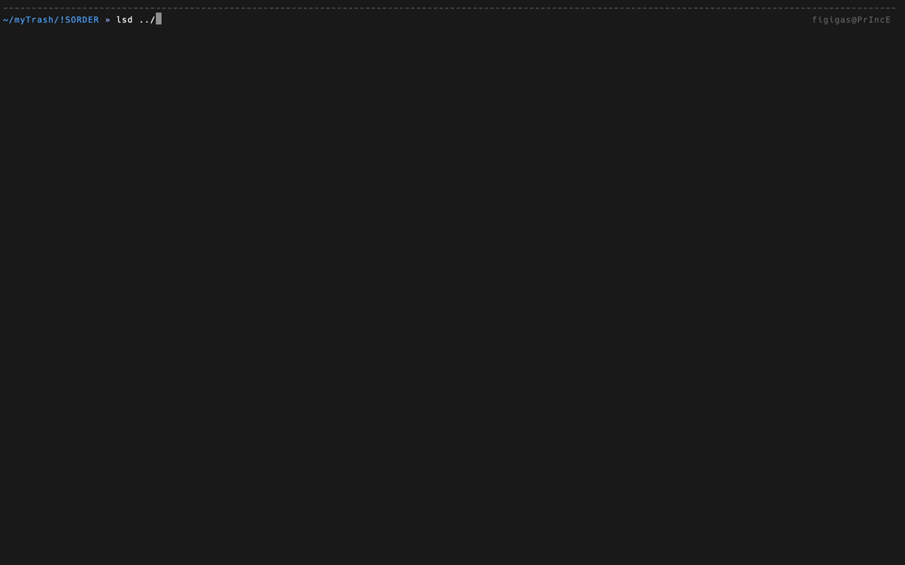

<h2 align="center"> sorting </h2>


- [Quick start](#quick)
- [What can do?](#what)
- [Config](#config)
- [New](#new)
- [Plan](#plan)

<h4 id="quick">Quick start</h4>

##### For Mac and linux

1. Download the release version and put it where you want it, open a command line
and go to the directory where the file sorter is, unzip it, delete the zip file,
and go to the sorter directory.

```bash
cd <path to where you want to go>

unzip <your platform>.zip 

rm -rf <your platform>.zip

cd <your platform>/
```

2. Run the file sorter using the command:

```bash
./sorter &
```

3. but for future use:

```bash
cd <path to where you want to go>/<your platform>/

./sorter &
```

##### For Windows

1. Download the release version and put it where you want it, open a command line
and go to the directory where the file sorter is, unzip it, delete the zip file,
and go to the sorter directory.

2. Run the file sorter

**❗ In this version, it must be run in the directory where the ❗**

<h4 id="what">What can do?</h4>

this sorter can sort files by category, and if there is a recurring file,
it will add its number to it in parentheses



<h4 id="config">Config</h4>

To configure the file sorter, open the config.toml file with a text editor
and edit it according to your needs. For each directory you want to sort,
create a corresponding section in the config.toml file.

For example:
```toml
extensions = ["txt", "pdf"]
```

this means that files with the extensions "txt" and "pdf" will
be moved to the "extensions" directory.

<h4 id="new">New</h4>

add background mode to work when something is changed in the directory

<h4 id="plan">Plan</h4>

- [x] 1.1.0 - add multiple files (this is when several files have the same name
        and not to overwrite the file just add the number at the end as Texte(number).txt)

- [x] 1.2.0 - add crossplatform for Winduos

- [x] 1.3.0 - add background mode to work when something is changed in the directory

- [ ] 1.4.0 - add it to be able to sort files where it's needed and it doesn't
        matter where it is
